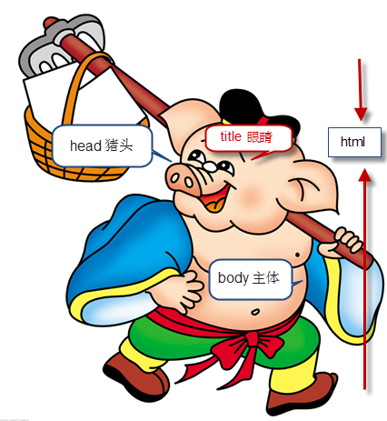

# 1.2-HTML基本结构

# HTML 初识

一般先学习HTML+CSS， 这里我们先定一个小目标，先学HTML,后学习CSS。

HTML（英文Hyper Text Markup Language的缩写）中文译为“超文本标签语言”，主要是通过HTML标签对网页中的文本、图片、声音等内容进行描述。

```html
<strong> 我是加粗的字体 </strong>
```

   注意：   体会 文本    标签    语言   几个词语  

## HTML骨架格式

日常生活的书信，我们要遵循共同的约定。 


同理：HTML 有自己的语言语法骨架格式：

```html
<HTML>   
    <head>     
        <title></title>
    </head>
    <body>
    </body>
</HTML>
```

课堂练习1：    书写我们的第一个HTML 页面！

1. 新建一个demo 的 TXT 文件。
2. 里面写入刚才的HTML 骨架。
3. 把后缀名改为 .HTML。
4. 右击--谷歌浏览器打开。

```
1 HTML标签：

作用所有HTML中标签的一个根节点。

2 head标签：

作用：用于存放：

title,meta,base,style,script,link

注意在head标签中我们必须要设置的标签是title

3.title标签：

作用：让页面拥有一个属于自己的标题。

4.body标签：

作用：页面在的主体部分，用于存放所有的HTML标签：

p,h,a,b,u,i,s,em,del,ins,strong,img

```


为了便于记忆，我们请出刚才要辞职回家养猪的二师兄来帮忙， 我称之为  猪八戒记忆法




