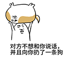
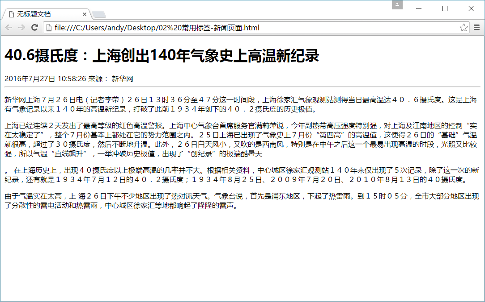

# 1.3-HTML常用标签

## HTML标签分类

  在HTML页面中，带有“< >”符号的元素被称为HTML标签，如上面提到的 &lt;HTML&gt;、&lt;head&gt;、&lt;body&gt;都是HTML标签。所谓标签就是放在“< >” 标签符中表示某个功能的编码命令，也称为HTML标签或 HTML元素

1.双标签

```html
<标签名> 内容 </标签名>
```

该语法中“<标签名>”表示该标签的作用开始，一般称为“开始标签（start tag）”，“</标签名>” 表示该标签的作用结束，一般称为“结束标签（end tag）”。和开始标签相比，结束标签只是在前面加了一个关闭符“/”。

> ```html
> 比如 <body>我是文字  </body>
> ```

2.单标签

```html
<标签名 />
```

  单标签也称空标签，是指用一个标签符号即可完整地描述某个功能的标签。

> ```html
> 比如  <br />
> ```

## HTML标签关系

标签的相互关系就分为两种：

1.嵌套关系

```html
<head>  <title> </title>  </head>
```


2.并列关系

```html
<head></head>
<body></body>
```


测试题：

```
请问下列哪个标签是错误的？
```

```
A  <head></head><body></body>
```

```
B  <strong><div></div></strong>
```

```
C  <head><title></head></title>
```

```
D  <body><div></div></body>
```


 倡议： 如果两个标签之间的关系是嵌套关系，子元素最好缩进一个tab键的身位。如果是并列关系，最好上下对齐。

# 开发工具

 这些工具你认识几个？

 

  普通青年    Dreamweaver

  文艺青年    sublime

  高手和傻子  用记事本

  其实。。。。

  

  <a href="key.HTML" target="_blank">sublime 一些常用快捷键  点我查看 </a>


```
再页面中输入 以下2个单词
1.  html: 5   
2.  !
   在sublime里面然后按下tab键盘即可生成HTML骨架

```


# 文档类型<!DOCTYPE>

```html
<!DOCTYPE html>
```

这句话就是告诉我们使用哪个html版本？  我们使用的是 html 5 的版本。  html有很多版本，那我们应该告诉用户和浏览器我们使用的版本号。

<!DOCTYPE> 标签位于文档的最前面，用于向浏览器说明当前文档使用哪种 HTML 或 XHTML 标准规范，必需在开头处使用<!DOCTYPE>标签为所有的XHTML文档指定XHTML版本和类型，只有这样浏览器才能按指定的文档类型进行解析。

注意：  一些老网站可能用的还是老版本的文档类型比如 XHTML之类的，但是我们学的是HTML5,而且HTML5的文档类型兼容很好(向下兼容的原则)，所以大家放心的使用HTML5的文档类型就好了。

# 字符集

<meta charset="UTF-8">

utf-8是目前最常用的字符集编码方式，常用的字符集编码方式还有gbk和gb2312。

gb2312 简单中文  包括6763个汉字

BIG5   繁体中文 港澳台等用

GBK包含全部中文字符    是GB2312的扩展，加入对繁体字的支持，兼容GB2312

UTF-8则包含全世界所有国家需要用到的字符

```
记住一点，以后我们统统使用UTF-8 字符集, 这样就避免出现字符集不统一而引起乱码的情况了。
```

# HTML标签的语义化

白话： 所谓标签语义化，就是指标签的含义。

## 为什么要有语义化标签

1. 方便代码的阅读和维护
2. 同时让浏览器或是网络爬虫可以很好地解析，从而更好分析其中的内容 
3. 使用语义化标签会具有更好地搜索引擎优化 

核心：合适的地方给一个最为合理的标签。

语义是否良好： 当我们去掉CSS之后，网页结构依然组织有序，并且有良好的可读性。

不管是谁都能看懂这块内容是什么。

遵循的原则：先确定语义的HTML ，再选合适的CSS。

# HTML标签

 首先 HTML和CSS是两种完全不同的语言，我们学的是结构，就只写HTML标签，认识标签就可以了。 不会再给结构标签指定样式了。

 HTML标签有很多，这里我们学习最为常用的，后面有些较少用的，我们可以查下手册就可以了。 

## 排版标签

排版标签主要和css搭配使用，显示网页结构的标签，是网页布局最常用的标签。

### 标题标签 (熟记)

 单词缩写：  head   头部. 标题 

为了使网页更具有语义化，我们经常会在页面中用到标题标签，HTML提供了6个等级的标题，即

 <h1>、<h2>、<h3>、<h4>、<h5>和<h6>

```
标题标签语义：  作为标题使用，并且依据重要性递减
```

其基本语法格式如下：

```html
<hn>   标题文本   </hn>
```


> 注意：  h1 标签因为重要，尽量少用，不要动不动就向你扔了一个h1。 一般h1 都是给logo使用。

  

### 段落标签( 熟记)

单词缩写：  paragraph  段落

 在网页中要把文字有条理地显示出来，离不开段落标签，就如同我们平常写文章一样，整个网页也可以分为若干个段落，而段落的标签就是

```html
<p>  文本内容  </p>
```

是HTML文档中最常见的标签，默认情况下，文本在一个段落中会根据浏览器窗口的大小自动换行。

### 水平线标签(认识)

单词缩写：  horizontal  横线

在网页中常常看到一些水平线将段落与段落之间隔开，使得文档结构清晰，层次分明。这些水平线可以通过插入图片实现，也可以简单地通过标签来完成，<hr />就是创建横跨网页水平线的标签。其基本语法格式如下：

```html
<hr />是单标签
```

 在网页中显示默认样式的水平线。

课堂练习2：    新闻页面

 


### 换行标签(熟记)

单词缩写：  break   打断 ,换行

在HTML中，一个段落中的文字会从左到右依次排列，直到浏览器窗口的右端，然后自动换行。如果希望某段文本强制换行显示，就需要使用换行标签

```html
<br />
```

这时如果还像在word中直接敲回车键换行就不起作用了。

### div span标签(重点)

div  span    是没有语义的     是我们网页布局主要的2个盒子

div 就是  division  的缩写   分割， 分区的意思  其实有很多div 来组合网页。

span, 跨度，跨距；范围    

语法格式：

```html
<div> 这是头部 </div>    <span>今日价格</span>
```


## 文本格式化标签(熟记)

在网页中，有时需要为文字设置粗体、斜体或下划线效果，这时就需要用到HTML中的文本格式化标签，使文字以特殊的方式显示。


  b  i  s  u   只有使用 没有 强调的意思       strong   em  del   ins  语义更强烈


## 标签属性


属性就是特性 比如 手机的颜色 手机的尺寸 ，总结就是手机的。。

使用HTML制作网页时，如果想让HTML标签提供更多的信息，可以使用HTML标签的属性加以设置。其基本语法格式如下：

```html
<标签名 属性1="属性值1" 属性2="属性值2" …> 内容 </标签名>
```


在上面的语法中，

1.标签可以拥有多个属性，必须写在开始标签中，位于标签名后面。

2.属性之间不分先后顺序，标签名与属性、属性与属性之间均以空格分开。

3.任何标签的属性都有默认值，省略该属性则取默认值。

采取  键值对 的格式   key="value"  的格式  

比如:  

```html
<hr width="400" />
```

属性  是 宽度  

值    是 400 

提倡：   尽量不使用 样式属性。    

## 图像标签img (重点)

单词缩写：   image  图像

HTML网页中任何元素的实现都要依靠HTML标签，要想在网页中显示图像就需要使用图像标签，接下来将详细介绍图像标签< img / >以及和他相关的属性。其基本语法格式如下：

该语法中src属性用于指定图像文件的路径和文件名，他是img标签的必需属性。

```html

```


## 链接标签(重点)

单词缩写：  anchor 的缩写 。基本解释 锚, 铁锚 的

在HTML中创建超链接非常简单，只需用标签环绕需要被链接的对象即可，其基本语法格式如下：

```html
<a href="跳转目标" target="目标窗口的弹出方式">文本或图像</a>
```

href：用于指定链接目标的url地址，当为标签应用href属性时，它就具有了超链接的功能。  Hypertext Reference的缩写。意思是超文本引用

target：用于指定链接页面的打开方式，其取值有_self和_blank两种，其中_self为默认值，_blank为在新窗口中打开方式。

注意：

1.外部链接 需要添加 http:// www.baidu.com

2.内部链接 直接链接内部页面名称即可 比如 < a href="index.html"> 首页 </a >

3.如果当时没有确定链接目标时，通常将链接标签的href属性值定义为“#”(即href="#")，表示该链接暂时为一个空链接。

4.不仅可以创建文本超链接，在网页中各种网页元素，如图像、表格、音频、视频等都可以添加超链接。

### 锚点定位 （难点）

通过创建锚点链接，用户能够快速定位到目标内容。
创建锚点链接分为两步：

```html
1.使用“a href=”#id名>“链接文本"</a>创建链接文本。

2.使用相应的id名标注跳转目标的位置。
```

### base 标签

base 可以设置整体链接的打开状态   

base 写到  <head>  </head>  之间

 


## 特殊字符标签 （理解）

 

## 注释标签

在HTML中还有一种特殊的标签——注释标签。如果需要在HTML文档中添加一些便于阅读和理解但又不需要显示在页面中的注释文字，就需要使用注释标签。其基本语法格式如下：
​        

```html
    <!-- 注释语句 -->
```

注释内容不会显示在浏览器窗口中，但是作为HTML文档内容的一部分，也会被下载到用户的计算机上，查看源代码时就可以看到。

注释重要性：


# 