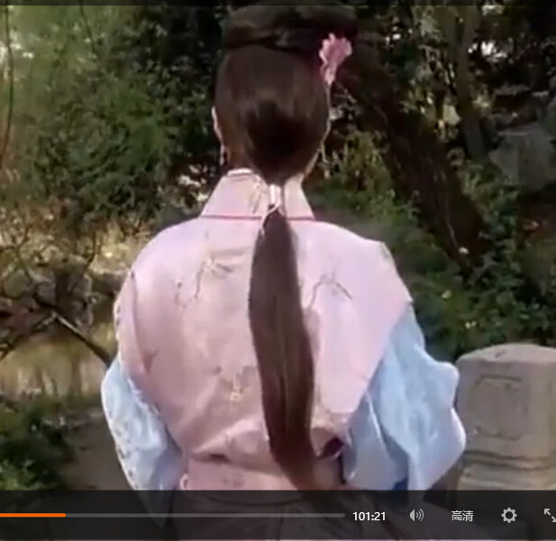

# 1.5-列表

# 列表标签

什么是列表？


把…制成表,以表显示

容器里面装载着文字或图表的一种形式，叫列表。

列表最大的特点就是  整齐 、整洁、 有序

## 无序列表 ul （重点）

无序列表的各个列表项之间没有顺序级别之分，是并列的。其基本语法格式如下：

```html
<ul>
  <li>列表项1</li>
  <li>列表项2</li>
  <li>列表项3</li>
  ......
</ul>
```

比如下面这些，新闻是没有顺序的，不用排队，先到先得，后发布先显示。


脚下留心：

```
 1. <ul></ul>中只能嵌套<li></li>，直接在<ul></ul>标签中输入其他标签或者文字的做法是不被允许的。
 2. <li>与</li>之间相当于一个容器，可以容纳所有元素。
 3. 无序列表会带有自己样式属性，放下那个样式，一会让CSS来！
```

## 有序列表 ol （了解）


有序列表即为有排列顺序的列表，其各个列表项按照一定的顺序排列定义，有序列表的基本语法格式如下：

```html
<ol>
  <li>列表项1</li>
  <li>列表项2</li>
  <li>列表项3</li>
  ......
</ol>
```

  所有特性基本与ul 一致。  

  但是实际工作中， 较少用 ol ，因此我们用一句话来总结下 ol： 

  


## 自定义列表（理解）

定义列表常用于对术语或名词进行解释和描述，定义列表的列表项前没有任何项目符号。其基本语法如下：

```html
<dl>
  <dt>名词1</dt>
  <dd>名词1解释1</dd>
  <dd>名词1解释2</dd>
  ...
  <dt>名词2</dt>
  <dd>名词2解释1</dd>
  <dd>名词2解释2</dd>
  ...
</dl>
```

  


用的还可以：


# 总结

  每一天都有一个主题 我们HTML第一天的主题就是 <认识标签>

学HTML 之前 觉得 很神秘  



等你学完之后忽然发现


总结今天的思路贯穿线：


# 