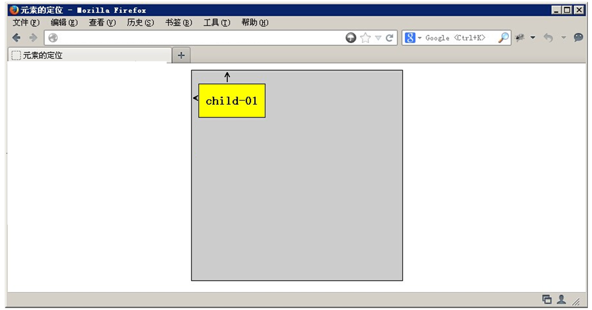

# 2.15-CSS四种定位及应用

# 定位(position)

如果，说浮动， 关键在一个 “浮” 字上面， 那么 我们的定位，关键在于一个 “位” 上。

PS: 定位是我们CSS算是数一数二难点的了，但是，你务必要学好它，我们CSS离不开定位，特别是后面的js特效，天天和定位打交道。不要抵触它，反而要爱上它，它可以让我们工作更加轻松哦！

## 为什么要用定位？

那么定位，最长运用的场景再那里呢？   来看几幅图片，你一定会有感悟！

第一幅图， 小黄色块可以再图片上移动：


第二幅图， 左右箭头压住图片：


第三幅图,  hot 再盒子外面多出一块，更加突出：


以上三个小地方，如果用标准流或者浮动，实现会比较复杂或者难以实现，此时我们用定位来做，just soso！

## 元素的定位属性

元素的定位属性主要包括定位模式和边偏移两部分。

1、边偏移

| 边偏移属性 | 描述                                           |
| ---------- | ---------------------------------------------- |
| top        | 顶端偏移量，定义元素相对于其父元素上边线的距离 |
| bottom     | 底部偏移量，定义元素相对于其父元素下边线的距离 |
| left       | 左侧偏移量，定义元素相对于其父元素左边线的距离 |
| right      | 右侧偏移量，定义元素相对于其父元素右边线的距离 |

也就说，以后定位要和这边偏移搭配使用了， 比如 top: 100px;  left: 30px; 等等

2、定位模式(定位的分类)

在CSS中，position属性用于定义元素的定位模式，其基本语法格式如下：

选择器{position:属性值;}

position属性的常用值

| 值       | 描述                                             |
| -------- | ------------------------------------------------ |
| static   | 自动定位（默认定位方式）                         |
| relative | 相对定位，相对于其原文档流的位置进行定位         |
| absolute | 绝对定位，相对于其上一个已经定位的父元素进行定位 |
| fixed    | 固定定位，相对于浏览器窗口进行定位               |

## 静态定位(static)

静态定位是所有元素的默认定位方式，当position属性的取值为static时，可以将元素定位于静态位置。 所谓静态位置就是各个元素在HTML文档流中默认的位置。

上面的话翻译成白话：  就是网页中所有元素都默认的是静态定位哦！ 其实就是标准流的特性。

在静态定位状态下，无法通过边偏移属性（top、bottom、left或right）来改变元素的位置。

PS： 静态定位其实没啥可说的。

## 相对定位relative(自恋型)

```
小笑话： 
刚刚看到一个超级超级帅的帅哥，看得我都忍不住想和他搞基了。世间怎会有如此之完美的男人。我和他就这样一动不动的对视着，就仿佛一见钟情。时间也在这一瞬间停止了。直到我的手麻了。才恋恋不舍的放下镜子。。。。
```


相对定位是将元素相对于它在标准流中的位置进行定位，当position属性的取值为relative时，可以将元素定位于相对位置。

对元素设置相对定位后，可以通过边偏移属性改变元素的位置，但是它在文档流中的位置仍然保留。如下图所示，即是一个相对定位的效果展示：


注意：   

1. 相对定位最重要的一点是，它可以通过边偏移移动位置，但是原来的所占的位置，继续占有。
2. 其次，每次移动的位置，是以自己的左上角为基点移动（相对于自己来移动位置）

就是说，相对定位的盒子仍在标准流中，它后面的盒子仍以标准流方式对待它。（相对定位不脱标）

如果说浮动的主要目的是 让多个块级元素一行显示，那么定位的主要价值就是 移动位置， 让盒子到我们想要的位置上去。

## 绝对定位absolute (拼爹型)

```
小笑话：

吃早饭时，老婆往儿子碗里放了两个煎蛋，儿子全给了我，还一本正经地说：“爸爸，多吃点，男人养家不容易。” <br/>

我一阵感动，刚想夸他两句。 

儿子接着说：“以后全靠你让我拼爹了！”
```


　[注意] 如果文档可滚动，绝对定位元素会随着它滚动，因为元素最终会相对于正常流的某一部分定位。

当position属性的取值为absolute时，可以将元素的定位模式设置为绝对定位。

注意：    绝对定位最重要的一点是，它可以通过边偏移移动位置，但是它完全脱标，完全不占位置。

### 父级没有定位

若所有父元素都没有定位，以浏览器为准对齐(document文档)。


### 父级有定位

绝对定位是将元素依据最近的已经定位（绝对、固定或相对定位）的父元素（祖先）进行定位。 




### 子绝父相

这个“子绝父相”太重要了，是我们学习定位的口诀，时时刻刻记住的。

这句话的意思是 子级是绝对定位的话， 父级要用相对定位。

首先， 我们说下， 绝对定位是将元素依据最近的已经定位绝对、固定或相对定位）的父元素（祖先）进行定位。

就是说， 子级是绝对定位，父亲只要是定位即可（不管父亲是绝对定位还是相对定位，甚至是固定定位都可以），就是说， 子绝父绝，子绝父相都是正确的。

但是，在我们网页布局的时候， 最常说的 子绝父相是怎么来的呢？ 请看如下图：


所以，我们可以得出如下结论：

因为子级是绝对定位，不会占有位置， 可以放到父盒子里面的任何一个地方。

父盒子布局时，需要占有位置，因此父亲只能是 相对定位. 

这就是子绝父相的由来。

## 绝对定位的盒子水平/垂直居中

普通的盒子是左右margin 改为 auto就可， 但是对于绝对定位就无效了

定位的盒子也可以水平或者垂直居中，有一个算法。

1. 首先left 50%   父盒子的一半大小

2. 然后走自己外边距负的一半值就可以了 margin-left。

   

## 固定定位fixed(认死理型)

固定定位是绝对定位的一种特殊形式，类似于 正方形是一个特殊的 矩形。它以浏览器窗口作为参照物来定义网页元素。当position属性的取值为fixed时，即可将元素的定位模式设置为固定定位。

当对元素设置固定定位后，它将脱离标准文档流的控制，始终依据浏览器窗口来定义自己的显示位置。不管浏览器滚动条如何滚动也不管浏览器窗口的大小如何变化，该元素都会始终显示在浏览器窗口的固定位置。

固定定位有两点：

1. 固定定位的元素跟父亲没有任何关系，只认浏览器。
2. 固定定位完全脱标，不占有位置，不随着滚动条滚动。


记忆法：  就类似于孙猴子， 无父无母，好不容易找到一个可靠的师傅（浏览器），就听的师傅的，别的都不听。


ie6等低版本浏览器不支持固定定位。

## 叠放次序（z-index）

当对多个元素同时设置定位时，定位元素之间有可能会发生重叠。


在CSS中，要想调整重叠定位元素的堆叠顺序，可以对定位元素应用z-index层叠等级属性，其取值可为正整数、负整数和0。

比如：  z-index: 2;

注意：

1. z-index的默认属性值是0，取值越大，定位元素在层叠元素中越居上。
2. 如果取值相同，则根据书写顺序，后来居上。
3. 后面数字一定不能加单位。
4. 只有相对定位，绝对定位，固定定位有此属性，其余标准流，浮动，静态定位都无此属性，亦不可指定此属性。


# 四种定位总结

| 定位模式         | 是否脱标占有位置     | 是否可以使用边偏移 | 移动位置基准                     |
| ---------------- | -------------------- | ------------------ | -------------------------------- |
| 静态static       | 不脱标，正常模式     | 不可以             | 正常模式                         |
| 相对定位relative | 不脱标，占有位置     | 可以               | 相对自身位置移动（自恋型）       |
| 绝对定位absolute | 完全脱标，不占有位置 | 可以               | 相对于定位父级移动位置（拼爹型） |
| 固定定位fixed    | 完全脱标，不占有位置 | 可以               | 相对于浏览器移动位置（认死理型） |

# 定位模式转换

跟 浮动一样， 元素添加了 绝对定位和固定定位之后， 元素模式也会发生转换， 都转换为 行内块模式，

** 因此 比如 行内元素 如果添加了 绝对定位或者 固定定位后 浮动后，可以不用转换模式，直接给高度和宽度就可以了。**

