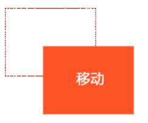

# 2.21-CSS3新增2D和3D属性及应

## 过渡(CSS3)

过渡（transition)是CSS3中具有颠覆性的特征之一，我们可以在不使用 Flash 动画或 JavaScript 的情况下，当元素从一种样式变换为另一种样式时为元素添加效果。

帧动画：通过一帧一帧的画面按照固定顺序和速度播放。如电影胶片


在CSS3里使用transition可以实现补间动画（过渡效果），并且当前元素只要有“属性”发生变化时即存在两种状态(我们用A和B代指），就可以实现平滑的过渡，为了方便演示采用hover切换两种状态，但是并不仅仅局限于hover状态来实现过渡。

语法格式:

```
transition: 要过渡的属性  花费时间  运动曲线  何时开始;
如果有多组属性变化，还是用逗号隔开。

```

| 属性                       | 描述                                         | CSS  |
| -------------------------- | -------------------------------------------- | ---- |
| transition                 | 简写属性，用于在一个属性中设置四个过渡属性。 | 3    |
| transition-property        | 规定应用过渡的 CSS 属性的名称。              | 3    |
| transition-duration        | 定义过渡效果花费的时间。默认是 0。           | 3    |
| transition-timing-function | 规定过渡效果的时间曲线。默认是 "ease"。      | 3    |
| transition-delay           | 规定过渡效果何时开始。默认是 0。             | 3    |

如果想要所有的属性都变化过渡， 写一个all 就可以

transition-duration  花费时间  单位是  秒     s    比如 0.5s    这个s单位必须写      ms 毫秒

运动曲线   默认是 ease

 何时开始  默认是 0s  立马开始

运动曲线示意图：


```css
div {
			width: 200px;
			height: 100px;
			background-color: pink;
			/* transition: 要过渡的属性  花费时间  运动曲线  何时开始; */
			transition: width 0.6s ease 0s, height 0.3s ease-in 1s;
			/* transtion 过渡的意思  这句话写到div里面而不是 hover里面 */
  
			
}
div:hover {  /* 鼠标经过盒子，我们的宽度变为400 */

			width: 600px;
			height: 300px
}

transition: all 0.6s;  /* 所有属性都变化用all 就可以了  后面俩个属性可以省略 */
```

## 2D变形(CSS3) transform

transform是CSS3中具有颠覆性的特征之一，可以实现元素的位移、旋转、倾斜、缩放，甚至支持矩阵方式，配合过渡和即将学习的动画知识，可以取代大量之前只能靠Flash才可以实现的效果。

变形转换 transform    transform  变换 变形的意思             《 transformers 变形金刚》

### 移动 translate(x, y)    

translate 移动平移的意思



```css
translate(50px,50px);
```

使用translate方法来将文字或图像在水平方向和垂直方向上分别垂直移动50像素。

可以改变元素的位置，x、y可为负值；

```
 translate(x,y)水平方向和垂直方向同时移动（也就是X轴和Y轴同时移动）
 translateX(x)仅水平方向移动（X轴移动）
 translateY(Y)仅垂直方向移动（Y轴移动）
```

```css
.box {
  width: 499.9999px;
  height: 400px;
  background: pink;
  position: absolute;
  left:50%;
  top:50%;
  transform:translate(-50%,-50%);  /* 走的自己的一半 */
}
```

 让定位的盒子水平居中

### 缩放 scale(x, y) 


```css
transform:scale(0.8,1);
```

可以对元素进行水平和垂直方向的缩放。该语句使用scale方法使该元素在水平方向上缩小了20%，垂直方向上不缩放。

```
scale(X,Y)使元素水平方向和垂直方向同时缩放（也就是X轴和Y轴同时缩放）
scaleX(x)元素仅水平方向缩放（X轴缩放）
scaleY(y)元素仅垂直方向缩放（Y轴缩放）
```

 scale()的取值默认的值为1，当值设置为0.01到0.99之间的任何值，作用使一个元素缩小；而任何大于或等于1.01的值，作用是让元素放大

### 旋转 rotate(deg) 

可以对元素进行旋转，正值为顺时针，负值为逆时针；


```css
transform:rotate(45deg);
```

 注意单位是 deg 度数  	

### transform-origin可以调整元素转换变形的原点


```css
 div{transform-origin: left top;transform: rotate(45deg); }  /* 改变元素原点到左上角，然后进行顺时旋转45度 */    

```

 如果是4个角，可以用 left top这些，如果想要精确的位置， 可以用  px 像素。

```css
 div{transform-origin: 10px 10px;transform: rotate(45deg); }  /* 改变元素原点到x 为10  y 为10，然后进行顺时旋转45度 */ 

```


案例旋转楚乔传

```css
div {
			width: 250px;
			height: 170px;
			border: 1px solid pink;
			margin: 200px auto;
			position: relative;

		}
		div img {
			width: 100%;
			height: 100%;
			position: absolute;
			top: 0;
			left: 0;
			transition: all 0.6s;
			transform-origin: top right;
		
		}
		div:hover img:nth-child(1) {  /* 鼠标经过div  第一张图片旋转 */
			transform: rotate(60deg);
		}
		div:hover img:nth-child(2) {  
			transform: rotate(120deg);
		}
		div:hover img:nth-child(3) {  
			transform: rotate(180deg);
		}
		div:hover img:nth-child(4) {  
			transform: rotate(240deg);
		}
		div:hover img:nth-child(5) {  
			transform: rotate(300deg);
		}
		div:hover img:nth-child(6) {  
			transform: rotate(360deg);
		}
```

### 倾斜 skew(deg, deg) 


```css
transform:skew(30deg,0deg);
```

该实例通过skew方法把元素水平方向上倾斜30度，处置方向保持不变。

可以使元素按一定的角度进行倾斜，可为负值，第二个参数不写默认为0。


## 3D变形(CSS3) transform

2d    x  y  

3d  x  y  z

 左手坐标系

伸出左手，让拇指和食指成“L”形，大拇指向右，食指向上，中指指向前方。这样我们就建立了一个左手坐标系，拇指、食指和中指分别代表X、Y、Z轴的正方向。如下图


CSS3中的3D坐标系与上述的3D坐标系是有一定区别的，相当于其绕着X轴旋转了180度，如下图


简单记住他们的坐标：

 x左边是负的，右边是正的

y 上面是负的， 下面是正的

z 里面是负的， 外面是正的

### rotateX() 

 就是沿着 x 立体旋转.


```css
img {
  transition:all 0.5s ease 0s;
}
img:hove {

  transform:rotateX(180deg);
}
```

### rotateY()

沿着y轴进行旋转


```css
img {
  transition:all 0.5s ease 0s;
}
img:hove {

  transform:rotateX(180deg);
}

```

### rotateZ()

沿着z轴进行旋转

```css
img {
  transition:all .25s ease-in 0s;
}
img:hover {
  /* transform:rotateX(180deg); */
  /* transform:rotateY(180deg); */
  /* transform:rotateZ(180deg); */
  /* transform:rotateX(45deg) rotateY(180deg) rotateZ(90deg) skew(0,10deg); */
}

```

### 透视(perspective)

电脑显示屏是一个2D平面，图像之所以具有立体感（3D效果），其实只是一种视觉呈现，通过透视可以实现此目的。

透视可以将一个2D平面，在转换的过程当中，呈现3D效果。

- 透视原理： 近大远小 。
- 浏览器透视：把近大远小的所有图像，透视在屏幕上。
- perspective：视距，表示视点距离屏幕的长短。视点，用于模拟透视效果时人眼的位置

注：并非任何情况下需要透视效果，根据开发需要进行设置。

perspective 一般作为一个属性，设置给父元素，作用于所有3D转换的子元素

理解透视距离原理：


### translateX(x)

仅水平方向移动**（X轴移动）


主要目的实现移动效果

### translateY(y)

仅垂直方向移动（Y轴移动）


### translateZ(z)

transformZ的直观表现形式就是大小变化，实质是XY平面相对于视点的远近变化（说远近就一定会说到离什么参照物远或近，在这里参照物就是perspective属性）。比如设置了perspective为200px;那么transformZ的值越接近200，就是离的越近，看上去也就越大，超过200就看不到了，因为相当于跑到后脑勺去了，我相信你正常情况下，是看不到自己的后脑勺的。

### translate3d(x,y,z)

[注意]其中，x和y可以是长度值，也可以是百分比，百分比是相对于其本身元素水平方向的宽度和垂直方向的高度和；z只能设置长度值

### 开门案例

```css
body {
}
.door {
  width: 300px;
  height: 300px;
  margin: 100px auto;
  border: 1px solid gray;
  perspective: 1000px;
  background: url('images/dog.gif') no-repeat cover;
  position: relative;
}
.door > div {
  box-sizing: border-box;
  border: 1px solid black;
}
.left {
  float: left;
  width: 50%;
  height: 100%;
  background-color: brown;
  transform-origin: left center;
  transition: 1s;
  position: relative;
}
.left::before {
  content: '';
  position: absolute;
  width: 20px;
  height: 20px;
  border-radius: 50%;
  top: 50%;
  right: 0px;
  transform: translateY(-10px);
  border: 1px solid whitesmoke;
}
.right {
  width: 50%;
  height: 100%;
  float: left;
  background-color: brown;
  transform-origin: right center;
  transition: 1s;
  position: relative;
}
.right::before {
  content: '';
  position: absolute;
  width: 20px;
  height: 20px;
  border-radius: 50%;
  top: 50%;
  left: 0px;
  transform: translateY(-10px);
  border: 1px solid whitesmoke;
}
.door:hover .left {
  transform: rotateY(-130deg);
}
.door:hover .right {
  transform: rotateY(130deg);
}
```


### backface-visibility 

backface-visibility 属性定义当元素不面向屏幕时是否可见。


### 翻转盒子案例

```css
div {
			width: 224px;
			height: 224px;
			margin: 100px auto;
			position: relative;
		}
		div img {
			position: absolute;
			top: 0;
			left: 0;
			transition: all 1s; 
		}
		div img:first-child {
			z-index: 1;
			backface-visibility: hidden; /* 不是正面对象屏幕，就隐藏 */
		}
		div:hover img {
			transform: rotateY(180deg);
}
```

## 动画(CSS3) animation

动画是CSS3中具有颠覆性的特征之一，可通过设置多个节点来精确控制一个或一组动画，常用来实现复杂的动画效果。

语法格式：

```css
animation:动画名称 动画时间 运动曲线  何时开始  播放次数  是否反方向;
```


关于几个值，除了名字，动画时间，延时有严格顺序要求其它随意r

```css
@keyframes 动画名称 {
  from{ 开始位置 }  0%
  to{  结束  }  100%
}
```

```
animation-iteration-count:infinite;  无限循环播放
animation-play-state:paused;   暂停动画"
```

